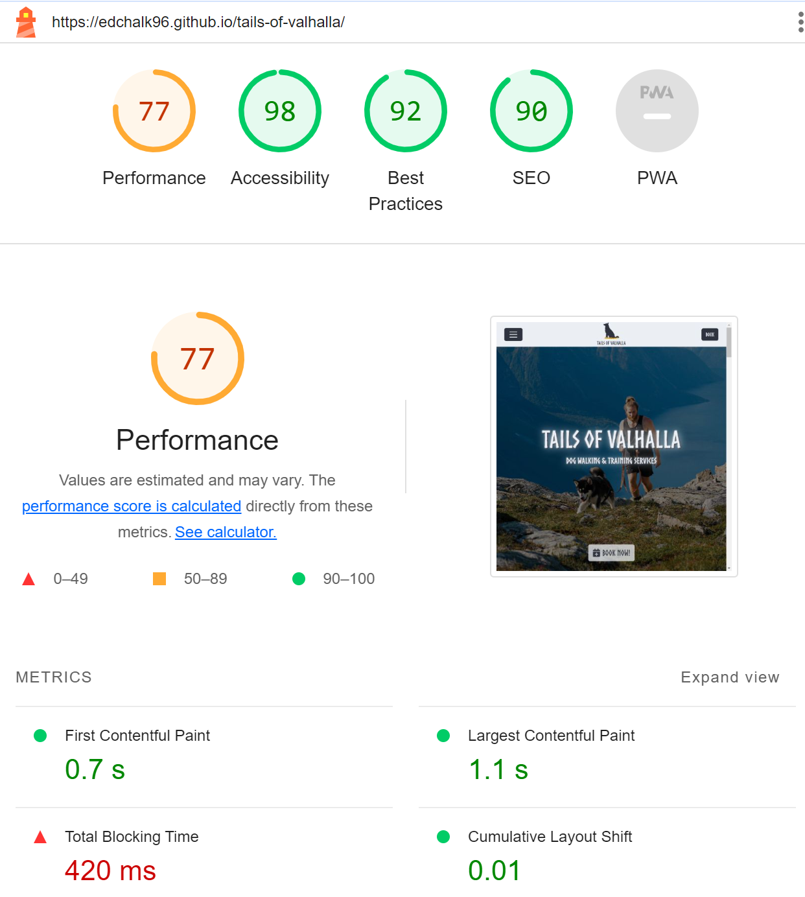
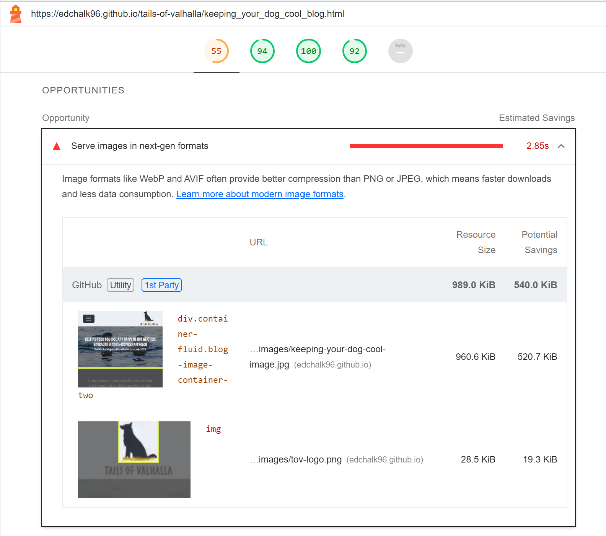

<h1 align="center">Tails of Valhalla | Dog Training & Walking Website - Project Portfolio 1</h1>

## By Ed Chalk

[View the live project here.](https://edchalk96.github.io/tails-of-valhalla/)

[View the repository here](https://github.com/edchalk96/tails-of-valhalla)

## Table of Contents:
1. [About the website](#about-the-website)
2. [User Experience (UX) | The 5 Planes](#user-experience-ux--the-5-planes)
    1. [Strategy Plane](#strategy-plane)
    2. [Scope Plane](#scope-plane)
    3. [Structure PLane](#structure-plane)
    4. [Skeleton Plane](#skeleton-plane)
    5. [Surface PLane](#surface-plane)
3. [Technologies Used](#technologies-used)
4. [Testing](#testing)
5. [Deployment](#deployment)
6. [Credits](#credits)

---

### About the website

This is a website for a fictional company, 'Tails of Valhalla', offering dog walking and dog training services. It is designed to be easy to navigate across a range of devices, making it easy for new and existing customers to book services easily and smoothly, as well as for prospective customers to find out more about the company and what they offer.

## User Experience (UX) | The 5 Planes

The project planning was based on the five planes of UX design, as described in Jesse James Garrett's book The Elements of User Experience. To assist in the planning process, I referred to an article titled ["UX Design using the Five Planes Method"](https://medium.com/designcentered/ux-design-5-planes-method-b1b1d6587c05) by Urooj Qureshi, which provides a detailed breakdown of the concepts outlined in the book. The following five planes served as a guiding framework for the project planning:

- The Strategy Plane
- The Scope Plane
- The Structure Plane
- The Skeleton Plane
- The Surface Plane

### Strategy Plane
---

### *Creator Goals*

The main goal of this project is to drive the user to book the companies services and improve buisness. To do this, the project will need the following:

- Smooth and easy navigation throughout.
- Ability to enter the booking page with ease from all locations in the project.
- Provide useful information to the end user about the company and services provided.
- Invoke a positive emotional response to the content and experience throughout.
- A consistent theme throughtout, aligning with the company's brand to distinguish itself from competitors, leading to a memorable project and, consequently, a company that is easily remembered.
- Well structured content, avoiding content heavy sections leading to the user feeling overwhelmed with information

### *User Stories*

This project is targerted at dog owners and prospective dog owners looking for dog training and/or dog walking services in their local area. 

- #### First Time Visitor Goals
    - As a first time visitor, I want to be able to easily identify I am on the correct website for the services I am looking for (i.e. dog walking/training). 
    - As a first time visitor, I want to easily identify where to book the services of the company
    - As a first time visitor, I want to be able to insinctively navigate the project 
    - As a first time, visitor I want to find out more information on the company, their services and prices.
    - As a first time visitor, I want to see if the trainers/walkers are certified and fully trained.
    - As a first time visitor, I want to be able to smoothly progress through the content and pages, whilst avoiding being overwhelmed by information.
    - As a first time visitor, I want the project to stand out from others.
    - As a first time visitor, I want to be able to see reviews/testimonials of other dog owners whom have used the companies services.
    - As a first time visitor, I want to feel as if this is a reputable company that offers trustworthy services to a high standard.
    - As a first time visitor, I want to locate the companies social media links, helping to determine how well known and trusted they are in the area.
    - As a first time visitor, I want to see images of the companies training and walking sessions.
    
- #### Returning Visitor Goals
    - As a returning visitor, I want to be able to easily head to the booking page. 
    - As a returning visitor, I want to be able to find contact information for the company with questions I may have.
    - As a returning visitor, I want to be able to read helpful tips on dog training and/or walking.

- #### Frequent User Goals
    - As a frequent user, I want to easily head to the booking page.
    - As a frequent user, I want to be able to check to see if there is any new updates to the services and/or new helpful blogs.
    - As a frequent user, I want to be able to see if there are any recent images of training/ walking sessions.

### Scope Plane
---
Using the strategy plane as a guide, and the creator/user goals therein, I can see what features are in scope for me to include in the project. One noteable mention I have identified from the user goals, is the inclusion of creating an account to manage bookings. At the time of writing, I do not possess the knowledge of back-end development required to implement this feature and this is therefore not in scope. An alternative feature, that is in scope, will be included in place of this to marginally address this user goal. To address the other creator/user goals, the following features are in scope to be included:

- A clean and minimal home/landing page including the company name and logo.
- A header, including a navigation bar to navigate through the project pages.
- A home page including the following sections/content:
    - "About Us" section including information about the company and the area the company operates.
    - "Services" section describing what services the company offers and their respective prices.
    - "Meet the team" section including information the team and their qualifications.
    - "Why us" section outlining what makes the company different/ what they offer during and outside of booked sessions.
    - "Testimonials"/"Reviews" section which include some reviews of customers that have used the company previously.
- A button which directs the user the booking page. This button will be easily identifiable and stand out at all times throughout the project.
- A booking page where the user can send their information, required service, dates and other relevant information. Here will also contain a check-box for if the user would like to receive weekly blogs in their inbox, which can also be seen on the blogs page (see below).
- A blogs page which includes blogs written by the company which contain helpful tips as well as any helpful links to aid dog owners in training/walking. This will also contain blogs with updates on the company.
- A unique and identifiable theme that aligns with the company brand throughout the project.
- A consistent footer at the bottom of each page, with the following relevant information:
    - Location of the company including postcode examples in which it operates.
    - The companies social media links.
    - Contact us link where the user are able to send any queries/questions they may have before requesting a booking.
- A Gallery page including images and videos of training and walking sessions.

### Structure Plane
---

The project aims to incorporate a cohesive theme inspired by the company's branding, which draws from Nordic/Norse mythology. With this in mind, inspirartion as well as careful attention will be given to integrating and incorporating these elements throughout the entire project.

### *Design*
#### Colour Scheme
- In keeping with a Nordic theme for this project, I researched Nordic colours leading to the discovery of [this site](https://www.nordtheme.com/), which gives examples of colours inspired by this theme. Out of the colours provided here, 2 were chosen for this project and were used as a base for the rest of the colour palette. As the primary colour is a shade of blue, and in knowing orange is the opposing/contrasting colour, I knew a shade of orange would be needed. Using this, and to narrow down a particular shade of orange whilst being able to visualise the contrast and colour palette as a whole, [this site](https://mycolor.space/?hex=%232E3440&sub=1) was used to generate a colour palette using the primary colour. After this research, the following colours will be used as the colour palette for this project: 

    - #2E3440 (Polar night blue)
    - #5C6270 (Dark shade of cyan blue)
    - #DAA21C (Dark shade of orange)
	- #ECEFF4 (Snow storm white)

#### Typography
- **Norse** and **NorseBold** will be the main font used for headings/titles/sub-titles in this project. This font was downloaded from [this website](https://www.1001fonts.com/norse-font.html#license) before being added to the project files and imported into the CSS file. In keeping with the company brand this font was chosen as it is inspired by the same theme of Norse mythology. For sections of the project that are more text heavy, **Belanosima** (imported from [Google Fonts](https://fonts.google.com/specimen/Belanosima#styles)) will be used so the text is easier to read for the user. The fallback font will be sans-serif in the instance these fonts are not imported into the project correctly.  

#### Imagery & Icons
- Icons will be used for the social media links in the footer of the project through all pages. These will be given a hover feature to give feedback to the user.
- In keeping with the company theme, runic characters, obtained via [this W3 schools site](https://www.w3schools.com/charsets/ref_utf_runic.asp), will be used in place of bullet points for unordered lists.
- The hero image presented to the user on the landing page of the project is important as it will be used to grab the users attention whilst also keeping with the company brand. The image chosen therefore shows a person and their dog win the foreground with mountains in the background.
- Other images within the project, including that in the Gallery, will be of dogs during training and/or walking with their owners/trainers.
- All images and content within the project with device responsive and therefore will scale accrodign the pixel width of the device.

### Skeleton Plane
---

### *Wireframes*
Below are the wireframes for all pages created for the project using Balsamiq. These wireframes are initial concepts forhow the project will be structured across different devices.

- #### Home Page - [View](https://github.com/edchalk96/tails-of-valhalla/blob/main/documentation/wireframes/home-page.pdf)
- #### Book Page - [View](https://github.com/edchalk96/tails-of-valhalla/blob/main/documentation/wireframes/book-page.pdf)
- #### Gallery Page - [View](https://github.com/edchalk96/tails-of-valhalla/blob/main/documentation/wireframes/gallery-page.pdf)
- #### Blogs Page - [View](https://github.com/edchalk96/tails-of-valhalla/blob/main/documentation/wireframes/blogs-page.pdf)
- #### Contact Us Page - [View](https://github.com/edchalk96/tails-of-valhalla/blob/main/documentation/wireframes/contact-us-page.pdf)
- #### Example Blog Page - [View](https://github.com/edchalk96/tails-of-valhalla/blob/main/documentation/wireframes/example-blog-page.pdf)

As these wire frames were an initial conceptualisation of the project, some aspects were required to be altered during development. The below list are differences seen between the wireframe and project:
 - Did not include the down scroll button on the home page as this made the home page look cluttered.
 - Images are not overlapped with coloured section blocks and are instead kept seperate for a cleaer look and feel.
 - Terms and conditions modal included in the Book page which was not included in the wire frames.
 - Text at the top of the Gallery page was not included as this did not provide any useful information and was deemed not needed.
 - Minor realignment of the different label and input boxes in the contact us page.

 ### Surface Plane
 ---

### *Features*

#### *Navbar* 
The navbar remains the same across all pages and is responsive and changes to a hamburger menu at 992 pixels. Once clicked the navbar items overlay the current pages content with a translucent white background to make them stand out. The logo in the centre of the navabr is a link back to the home page. The current active page is indicated in the navbar by being underlined and orange (#DAA21C) or underlined and white (#ECEFF4) when the hamburger icon is toggled.

#### *Footer*
The footer remains the same across all pages and contains information about the company. Contact information is included as informaiton and the sub-heading for this information is a link to the Contact Us page for to make this easier for the user to make contact. Links are also included to the companies social media pages, contained within the respective social meida platforms icon.

#### *Hero Image & Images*
The hero image was selected to fit within the theme of the company and contains a dark overlay so the company logo and book button stand out against the image. All other images used were also chosen as they are relatable to the company and the section they are within on the website.

#### *Logo*
The company logo, used in the navbar, was created by myself (author of website) by outlining an existing image taken by myself and filling this in with the colour pallete of the company/website.

---

## Technologies Used

### *Languages Used*

- HTML5
    - Used as the basic building block for the project and to structure the content.
- CSS3
    - Used to style all of the web content across the project.

### *Frameworks, Libraries & Programs Used*

- Bootstrap (v5.3)
    - Used as the main framework to aid in making the project responsive.
- Hover.css
    - This was used to create hover effects on buttons and other items that contain links or perform actions, such as modal links.
- Font Awesome (v6.4.2)
    - This was used to add icons throughout the project.
- Google Fonts
    - Google fonts was used to import the 'Belanosimo' font which was used when the main font could not be used due the content being text heavy.
- Git
    - This was used for version control by utilising the Gitpod terminal to commit to Git and Push to GitHub
- GitHub
    - This was used to store Used to code for the project after being pushed.
- Balsamiq
    - This was used to create the wireframes for the project before being coded, as seen in the skeleton plane.
- W3 Schools
    - W3 schools was another framework used for the project, most nottably the unicode for the runic symbols used in place of bullet points.
- Concepts
    - This was the program used to create the logo for the company.
---

## Testing
The W3C Markup Validator and W3C CSS Validator Services were used to validate every page of the project to ensure there were no syntax errors in the project.

- [W3C Markup Validator](https://validator.w3.org/)
    - Home page - [Results](./assets/images/w3c-validator-home.png)
    - Book page - [Results](./assets/images/w3c-validator-book.png)
    - Gallery page - [Results](./assets/images/w3c-validator-gallery.png)
    - Blogs page - [Results](./assets/images/w3c-validator-blogs.png)
    - Bristol barkers blog page - [Results](./assets/images/w3c-validator-bristol-barkers-blog.png)
    - Keeping your dog cool blog page - [Results](./assets/images/w3c-validator-keeping-your-dog-cool-blog.png)
    - Prepare frozen kong blog page - [Results](./assets/images/w3c-validator-prepare-frozen-kong-blog.png)
    - Contact Us - [Results](./assets/images/w3c-validator-contact-us.png)

- [W3C CSS Validator](https://jigsaw.w3.org/css-validator/) - [Results](./assets/images/w3c-css-validation.png)

### Testing User Stories from User Experience (UX) Section

- #### First Time Visitor Goals
    1. **As a first time visitor, I want to be able to easily identify I am on the correct website for the services I am looking for (i.e. dog walking/training).**
        - When first visiting the home page, the user is immediately greeted company name and services provided in big bold writing, at the centre of the page.
    2. **As a first time visitor, I want to easily identify where to book the services of the company.**
        - When first entering the site, the user is greeted with the hero image along with a big *Book Now* button at the bottom of the hero image/page which takes thes user to the *Book* page.
        - Additionally, the navbar at the top of the page (or in the hamburger menu) also has a clear link to this page.
    3. **As a first time visitor, I want to be able to insinctively navigate the project.**
        - The navbar for the site is at the top of page, on every page, (or in the hamburger menu). 
        - The respective page that the user is currentrly on, also changes colour and is underlined to signify to the user which page they are currently on for easy navigation.
    4. **As a first time, visitor I want to find out more information on the company, their services and prices.**
        - On the home page, when the user scrolls down, the user will initially dicsover some background infomation on the company and then below this, easy to use drop down list describing the different services provided by the company.
    5. **As a first time visitor, I want to see if the trainers/walkers are certified and fully trained.**
        - With futher scrolling down the home page, the user is greeted with an easy to use carousel, which shows the companies trainers including brief infomation on them and their qualifications.
    6. **As a first time visitor, I want to be able to smoothly progress through the content and pages, whilst avoiding being overwhelmed by information.**
        - The site has been designed to to navigate the content smoothly and avoid the user from feeling overhelmed with infomation.
        - The company logo at the top of the page within the navbar, which appears on every page, is also a link back to the home page.
    7. **As a first time visitor, I want the project to stand out from others.**
        - With bold, contrasting colours and a unique theme included in the design/content, the site stands out from others.
    8. **As a first time visitor, I want to be able to see reviews/testimonials of other dog owners whom have used the companies services.**
        - Further down, at the bottom of the home page, contains 3 card-like testimonails of existing customers of the company. Pictures and names of the customers dogs have been used to keep the customers anonymous.
    9. **As a first time visitor, I want to feel as if this is a reputable company that offers trustworthy services to a high standard.**
        - With the inclusion testimaonials and an easy to use site with all the essential infomation, the site offers the feel of trustworthy company.
    10. **As a first time visitor, I want to locate the companies social media links, helping to determine how well known and trusted they are in the area.**
        - In the footer of the site, which appears on every page, contains the logos for Facebook and Instagram, which are also links to the companies social media sites respectively.
    11. **As a first time visitor, I want to see images of the companies training and walking sessions.**
        - Within, the navbar there is a link to the gallery page which contains images of the dogs during sessions with a description of what they are doing/ what is being trained. 

- #### Returning Visitor Goals
    1. **As a returning visitor, I want to be able to easily head to the booking page.**
        - When first entering the site, the user is greeted with the hero image which, at the bottom, contains a big *Book Now* button at the bottom of the hero image/page which takes thes user to the *Book* page.
    2. **As a returning visitor, I want to be able to find contact information for the company with questions I may have.**
        - At the bottom of every page, within the footer, contains the contact information for the company if the user wishes to get in contact.
        - Additionally, within the navbar (and hamburger menu) contains a link to the contact us page, which the user can fill in their information and question which then gets set to the company.
    3. **As a returning visitor, I want to be able to read helpful tips on dog training and/or walking.**
        - Within the navbar (or hamburger menu) contains a link to the blogs page which contains card-like blog descriptions. Within these cards contains a *Read More* button which takes the user to the specific blog page.

- #### Frequent User Goals
    1. **As a frequent user, I want to easily head to the booking page.**
        - When first entering the site, the user is greeted with the hero image which, at the bottom, contains a big *Book Now* button at the bottom of the hero image/page which takes thes user to the *Book* page.
    2. **As a frequent user, I want to be able to check to see if there is any new updates to the services and/or new helpful blogs.**
        - Within the navbar (or hamburger menu) contains a link to the blogs page which is updated. Each blog contains information on who wrote it and the date it was posted.
    3. **As a frequent user, I want to be able to see if there are any recent images of training/ walking sessions.**
        -  Within, the navbar there is a link to the gallery page which contains images of the dogs during sessions with a description of what they are doing/ what is being trained. New images will be added as and when there are new images to be added.

### Further Testing
- The website was tested on the following browsers with success: 
    - Google Chrome
    - Microsoft Edge
    - Mozilla Firefox
    - Opera
    - Safari
- The webiste was tested throughout using chrome developer tools especially to test the responsiveness of the site, using emulators and generic screen sizes (based on pixels) with success.
- Constructive feedack and bug testing was received from friends/colleagues/relatives who were asked to review the site.
- Lighthouse, a feature of Google Chrome developer tools was used to assess the performance of the website, it's features and where approproiate, analyse what improvememts could be made to improve the sites performance. Each page of the site was tested with a few amendments being made as a result, as showm below:

1. **Home page**

 
 
 

- As can be seen by the above images the performance parameter of the home page needed improvement. By looking further into this in the analysis sections of the lighthous report, it could be seen that the image files linked within the page needed compressing.
    - After the above amendments of compressing the image files, the performance paramter of the lighthouse report has improved, as can be seen below.
    
    

2. **Book page**

- As can be seen by the above image, all parameters tested for the Book page are performing well for this page (all 90+/green) and therefore no amendments for this page were deemed necessary.

3. **Gallery page**

- As can be seen by the above images the performance and accessibility parameters of the gallery page needed improvement. By looking further into this in the analysis sections of the lighthous report, it could be seen that the image files linked within the page needed compressing to improve the performance. Further to this, alt attributes were missing from some of the images within the page and these have been added (see Known Bugs and Fixes for further details). Additionally, it can be seen that the social media icons, did not contain alternate text. Therefore an `aria-label` was added to each icon and this fix was applied to each page within the project.
    - After the above amendments, the performance and accessability paramters of the lighthouse report have improved, as can be seen below.

    

4. **Blogs**

- As can be seen by the above images the performance parameter of the Blogs page needed improvement. By looking further into this in the analysis sections of the lighthous report, it could be seen that the image files linked within the page needed compressing.
    - After the above amendments of compressing the image files, the performance paramter of the lighthouse report has improved, as can be seen below.

    

5. **Bristol barkers blog page**

- As can be seen by the above images the performance parameter of the Bristol barkers blog page needed improvement. By looking further into this in the analysis sections of the lighthous report, it could be seen that the image file linked within the page needed compressing.
    - After the above amendment of compressing the image file, the performance paramter of the lighthouse report has improved, as can be seen below.

    

6. **Keeping your dog cool blog page**

- As can be seen by the above images the performance parameter of the Keeping your dog cool blog page needed improvement. By looking further into this in the analysis sections of the lighthous report, it could be seen that the image file linked within the page needed compressing.
    - After the above amendment of compressing the image file, the performance paramter of the lighthouse report has improved, as can be seen below.

    

7. **Prepare frozen kong blog page**

- As can be seen by the above images the performance parameter of the Prepare frozen kong blog page needed improvement. By looking further into this in the analysis sections of the lighthous report, it could be seen that the image file linked within the page needed compressing.
    - After the above amendment of compressing the image file, the performance paramter of the lighthouse report has improved, as can be seen below.

    

8. **Contact us page**

- As can be seen by the above images the accessibility parameter of the Contact us page needed improvement. By looking further into this in the analysis sections of the lighthous report, it could be seen that the text area of the form contained a duplicate ID. This bug was fixed by removing the initial instance of the ID (see Known Bugs and Fixes for further details). 
    - After the above amendments, the performance and accessability paramters of the lighthouse report have improved, as can be seen below.

    

### Known Bugs and Fixes
- At exactly 992 pixels, when the navbar transitions from a full navbar to a hamburger menu, the navbar gets pushed below the header and in the CSS style of the hamburger menu items. No fix found for this as of yet so this is still to be fixed at a later date.

- During W3C validator testing a warning was flagged up ([see here](assets/images/w3c-validator-warning.png)) with the following message: "The document is not mappable to XML 1.0 due to two consecutive hyphens in a comment.". This is used in the comments when dividing the ocde into sections. In order to fix/remove this warning message, `<!------` was changed to `<!-- ===`, and in doing so the same structure of the sectioning remained. Credit to Harry Leepz's [Skihism Project Read.me file](https://github.com/Harry-Leepz/Sikhism-Project/blob/master/README.md) for for this fix.

- During W3C validator testing of the index.html page, an error regarding the navbar logo image ([see here](assets/images/w3c-validator-navbar-logo-error.png)) was picked up with the following message: "Bad value 50px for attribute width on element img: Expected a digit but saw p instead." In order to fix this, "px" was removed from the code leaving the following code `width="50"`. This fix was implemented across all pages as the navbar is ever-present on the site.

- During W3C validator testing of the index.html page, an error flagged up for an duplicated ID of `id="accordionExample"` in the *Our Services* section ([see here](assets/images/w3c-validator-duplicate-id.png)). This was fixed by renaming the first instance this ID appears to `id="accordionDogWalking"`. This error also occured during the testing for thecontact-us.html page, where `<id="message">` was used on two occasions. This was fixed by removing the first instance of this ID from the div it was contained within.

- During W3C validator testing of the index.html page, an error flagged up ([see here](assets/images/w3c-validator-button-p-error.png)) with the following message: "Element p not allowed as child of element button in this context. (Suppressing  further errors from this subtree.)". This was fixed by removing the paragraph element from the code, as well as the ID and respective CSS styling code.

- During W3C validator testing of the index.html page, an error flagged up ([see here](assets/images/w3c-validator-aria-controls-error.png)) with the following message: "The aria-controls attribute must point to an element in the same document.". This was fixed by updating the aria-contols code from `aria-controls="navbarTogglerDemo01"` to `aria-controls="navbar-content"`.

- During W3C validator testing of the book.html page, two errors flagged up ([see here](assets/images/w3c-validator-input-type.png)) with the following messages: "Bad value textarea for attribute type on element input." and "Attribute placeholder is only allowed when the input type is email, number, password, search, tel, text, or url.". Both of these errors were fixed by amending the input type from `type="textarea"` to `type="text"`. This amendment was also implemented to the contact-us page which contained the same input type previsouly.

- During W3C validator testing of the gallery.html page, an error flagged up multiple times ([see here](assets/images/w3c-validator-a-alt-attribute.png)) with the following message: "Attribute alt not allowed on element a at this point.". This was fixed by altering the attirbute from `alt` to `aria-label`, keeping the codes intended purpose of accessibility.

- During W3C validator testing of the gallery.html page, an error flagged up multiple times ([see here](assets/images/w3c-validator-img-alt-attribute.png)) with the following message: "An img element must have an alt attribute, except under certain conditions. For details, consult guidance on providing text alternatives for images.". In order to fix this, the code for each image was looked at and an alt attriute was given to those where one was not present.

- During W3C validator testing of the bristol-barkers-blog.html page, an error flagged ([see here](assets/images/w3c-validator-h6-error.png)) with the following message: "End tag h6 seen, but there were open elements.". This was caused by a `h4` element being closed by a `</h6>` and fixed by changing this to a `</h4>`. This was also flagged multiple times on the keeping-your-dog-cool-blog.html and prepare-frozen-kong-blog.html pages and was fixed the same way.

- During W3C validator testing of the keeping-your-dog-cool-blog.html page, an error flagged multiple times ([see here](assets/images/w3c-validator-unicode-semicolon.png)) with the following message: "Character reference was not terminated by a semicolon.". This was caused by the html unicode characters not containing a semicolon at the end and hence fixed by adding this into the code on each occasion unicode characters were used.

- During W3C validator testing of the keeping-your-dog-cool-blog.html page, an error flagged multiple times ([see here](assets/images/w3c-validator-&nbsp-semicolon.png)) with the following message: "Named character reference was not terminated by a semicolon.". This was caused by the `&nbsp` code not containing a semicolon at the end and hence fixed by adding this into the code on each occasion this was used.

---

## Deployment

### GitHub Pages
This project is deployed using GitHub pages, achieved by the following steps:

1. Log in to GitHub and locate the relevant [GitHub repository](https://github.com/edchalk96/tails-of-valhalla)
2. Locate and click on the *Settings* link at the end of the horizontal menu, located at the top of the repository page.
3. Locate and click on the *Pages* link on the left-hand side of the *Settings* page.
4. In the *Build and deployment* section, under *Branch* click on *None* to reveal a dropdown menu and select *main*.
5. Click *save* and refresh the page.
6. Locate the now live site [link](https://edchalk96.github.io/tails-of-valhalla/) at the top of the *GitHub Pages* page.

### Forking the GitHub Repository
Forking the GitHub repository allows you to make a copy of he original repository to view and/or make changes without afeecting the original repository. The following steps will fork your GitHub repository:
1. Log in to GitHub and locate the relevant [GitHub repository](https://github.com/edchalk96/tails-of-valhalla)
2. At the top of the **repository page**, south-east of *Settings*, locate the *Fork* button and click.
3. This will now have created a copy of the oringial repository in your GitHub account.

### Making a Local Clone
Text here
1. Log in to GitHub and locate the relevant [GitHub repository](https://github.com/edchalk96/tails-of-valhalla)
2. Under the repository name, to the right, click on the green **<> Code** dropdown button.
3. To clone the repository using HTTPS, copy the URL by clicking the *copy to clipboard* icon or alternatively hightlight the URL, right click and copy.
4. Open GitBash
5. Change the working directory to the location where you would like the clines directory to be located.
6. Type 'git clone' and paste the copied URL from step 3.
7. Press enter and your local clone will be created in the selected location.

---

## Credits

### Code
- [Stackoverflow](https://stackoverflow.com/)
    - Used to find solutions and troubleshoot bugs and issues with the project code.
- [Code Institue](https://codeinstitute.net/)
    - Elements within the project taken from the courses example coding projects, such as the dark overlay code for the hero image.
- [Bootstrap v5.3](https://getbootstrap.com/)
    - This was used throughout the project as a framework library to assist in making the site responsive as well as other coding elements.
- [W3 Schools](https://www.w3schools.com/)
    - Used throughtout the project, and referenced therein, to assist with various coding elements.
- [Epic Bootstrap](https://epicbootstrap.com/)
    - Provided examples of certain page elements and provided links to see the code. This was used for the lightbox code in the gallery.html page.

### Content
- [Nord](https://www.nordtheme.com/)
    - Used to find/take inspiration for the best colour scheme for the website.
- [ChatGPT](https://chat.openai.com/)
    - Used to generate/assist in the writing of large pieces of text content.
- [1001 fonts](https://www.1001fonts.com/)
    - Used to get access and download the **Norse** font imported into the project.

### Media 
- [Unsplash](https://unsplash.com/)
    - Used for images throughout the project.
- [Pixabay](https://pixabay.com/)
    - Used for images throughout the project.
- [CompressJPG](https://compressjpeg.com/)
    - Used to compress large file size images to improve page performance
- [TinyPNG](https://tinypng.com/)
    - Used to compress the large images files linked to in the gallery page further.
- Some images were taken and created by the developer, including the company logo seen in the navbar.

### Acknowledgements
- Darío Carrasquel for support and feedback throughout the project.
- Nigel Ewwards for his continous support and feedback throught the development of the project.
- Tutor support at Code Institue for support during the development of the project.